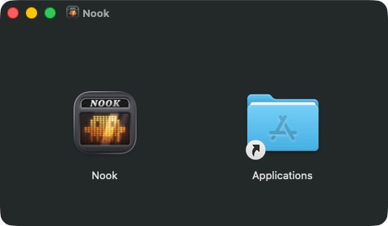

# Nook

<p align="center">
  
</p>

<p align="center">
  <strong>A live MacBook notch surface for agents, music, and system status.</strong>
</p>

<p align="center">
  <a href="./readme/README.zh-CN.md">Simplified Chinese</a> ·
  <a href="https://github.com/oa1mgo/nook-notch/releases/latest">Download latest release</a>
</p>

<p align="center">
  
</p>

<p align="center">
  
</p>

<p align="center">
  
  
  
</p>

Nook turns the MacBook notch into a compact desktop control layer. The home view keeps high-signal context in one place: Mac performance, now playing controls, and live AI coding sessions.

## What It Does

| Area | Features |
| --- | --- |
| Agent sessions | Monitor Claude Code, Codex, OpenCode, and Cursor from local hook events. |
| Session detail | Show prompts, thinking, tool calls, tool results, approvals, user questions, completion state, and token usage. |
| Questions and approvals | Answer OpenCode questions in the notch, review permissions, and use keyboard shortcuts to respond. |
| Music | Display artwork, source app, track metadata, progress, playback controls, and artwork-colored glow with optional audio-reactive effects. |
| System status | Surface CPU, memory, battery, and network status with configurable performance detail pages. |
| Settings | Configure screen selection, notification sound, agent hooks, shortcuts, glow effects, launch at login, accessibility, and opt-in Beta features. |
| Appearance | Switch between Music dynamic color, macOS 26+ Glass, and pure Black notch styles. |

## Agent Support

Nook normalizes local agent events into a shared session timeline.

- Claude Code: hooks, transcript parsing, status tracking, interrupt detection, permission handling, and tmux-aware terminal focus.
- Codex: live direct-user and assistant messages, complete multi-file transcript history, terminal approval state, compacting/subagent events, and stable completed sessions. Injected memory and system context stay out of the conversation.
- OpenCode: live text, reasoning and tool updates, inline permission decisions and question answers, subagent tracking, and replies routed to the owning process and project when multiple instances are running.
- Cursor: session lifecycle, processing/compacting state, thought and response updates, tool calls, and session cleanup.

## Questions and Approvals

Click a session to open its conversation. When an agent needs an answer, the collapsed notch shows a question indicator; OpenCode questions can open a dedicated answer panel with single-choice or multiple-choice options. Questions that allow a custom answer also show a text field. Choose your answers, then press `Enter` or click Send to submit. Each question keeps its selection when you navigate between cards.

OpenCode supports answering directly in Nook through its bundled plugin. Claude Code, Codex, and Cursor use `Go to Terminal` to continue answering in the agent's terminal. Enable the matching integration in Nook's agent settings; after upgrading, restart OpenCode so it loads the updated plugin.

To send new chat messages to OpenCode from the conversation view, run it inside tmux or start it with an HTTP listening port (`--port`).

The default shortcuts are:

| Context | Shortcut | Action |
| --- | --- | --- |
| Session list | `Ctrl+R` | Open a waiting session's question panel. |
| Session list / permission bar | `Y` / `N` | Approve once / reject an eligible request. |
| OpenCode permission bar | `A`, then `C` | Review the displayed patterns, then confirm Always allow; `Esc` cancels this confirmation. |
| Question options | `↑` / `↓` or `Ctrl+P` / `Ctrl+N` | Move between options; single-choice selection follows focus. |
| Multiple-choice question | `Space` | Toggle the focused option. |
| Question with custom input | `Tab` | Switch between options and the text field. |
| Multiple questions | `Ctrl+[` / `Ctrl+]` | Previous / next question. |
| Answer panel | `Enter` | Submit the answers. |

In the session list, reply and approval shortcuts act directly when there is exactly one eligible waiting session, even without a highlighted row. With several eligible sessions, highlight the one you want first; with none, the shortcut does nothing. Permission shortcuts do not act while you are typing in a text field.

## Appearance

The settings page exposes three notch styles:

- `Music`: uses artwork-derived colors for the expanded notch when music is playing.
- `Glass`: uses Liquid Glass on macOS 26+ and only appears when supported.
- `Black`: keeps the expanded notch clean and solid black.

The collapsed notch stays visually quiet; the glass treatment is limited to the expanded panel.

## Music Glow

Turn on `Settings` → `Music Edge Glow` for artwork-colored light around the collapsed notch. By itself, this uses a fixed breathing rhythm and requires no audio-capture permission.

For real audio response, also open `Settings` → `Beta Features...` (below Accessibility) and enable `Audio-Reactive Music Glow`. This Beta option is off by default; enabling it requests macOS system-audio recording permission.

- Audible attacks brighten the glow above a low, persistent album-colored base, then settle back to that base. There is no fixed-frequency fallback while audio analysis is active.
- Confirmed sparse passages get a gentler, longer tail; dense music stays responsive, with the same quick 50ms rise.
- Music without strong attacks keeps the base light. Pausing fades the glow out and stops capture; sustained silence also extinguishes it.
- The compact notch's four music bars show analyzed audio levels while Beta capture is running; otherwise, they retain their simulated animation.
- Audio is analyzed locally in memory, not saved to recordings or uploaded. This uses system playback audio, not microphone input.

Turning off Beta restores the regular permission-free breathing effect. Beat response remains experimental, and Bluetooth output delay is not automatically compensated.

## Install

<p align="center">
  
</p>

1. Download and open the latest Nook `.dmg` from [Releases](https://github.com/oa1mgo/nook-notch/releases/latest).
2. Drag `Nook` onto the `Applications` folder in the installer window.
3. Open `Nook` from `Applications`.

Once copying finishes, you can eject the Nook disk image.

The installer uses Finder's native background, icons, and labels, without a background image to scale.

If macOS blocks the first launch, open `System Settings` -> `Privacy & Security`, allow Nook to run, then open it again.

## Requirements

- macOS 15.6 or later.
- macOS 26 or later for the Glass appearance option.
- Claude Code, Codex, OpenCode, or Cursor installed for the matching agent integration.
- Accessibility permission is recommended for global shortcuts and focus behavior.
- System-audio recording permission is only needed for Audio-Reactive Music Glow Beta.

## Build From Source

```bash
xcodebuild -project Nook.xcodeproj -scheme Nook -configuration Debug build
```

```bash
xcodebuild test -project Nook.xcodeproj -scheme Nook -configuration Debug -derivedDataPath build/TestDerivedData -destination 'platform=macOS'
```

See [docs/testing.md](./docs/testing.md) for testing notes.
For the Music Glow design, regression coverage, and a reproducible five-style audio comparison, see the [Music Glow technical notes](./docs/specs/2026-09-11-music-glow-transients.md).
For building and validating the drag-to-install disk image, see [DMG packaging](./docs/packaging.md).

## Project Map

- `Nook/Core`: settings, geometry, shortcuts, activity coordination, and view model state.
- `Nook/Services/Hooks`: hook installers and Unix socket ingress for agent events.
- `Nook/Services/Session`: transcript parsing, status watching, and session monitoring.
- `Nook/Services/State`: central session store and tool-event processing.
- `Nook/Services/Question`: agent-specific question reply providers and terminal fallback.
- `Nook/Services/Music`: now playing integration, media controls, artwork colors, and opt-in system-audio analysis for reactive glow and music bars.
- `Nook/Services/System`: performance sampling.
- `Nook/UI`: notch shell, session list, chat detail, music, performance, and settings views.

## Acknowledgements

Nook was shaped by ideas from:

- [farouqaldori/claude-island](https://github.com/farouqaldori/claude-island)
- [TheBoredTeam/boring.notch](https://github.com/TheBoredTeam/boring.notch)

Thanks to [@wuruofan](https://github.com/wuruofan) for the question panel, keyboard interactions, and OpenCode improvements in [PR #19](https://github.com/oa1mgo/nook-notch/pull/19).
